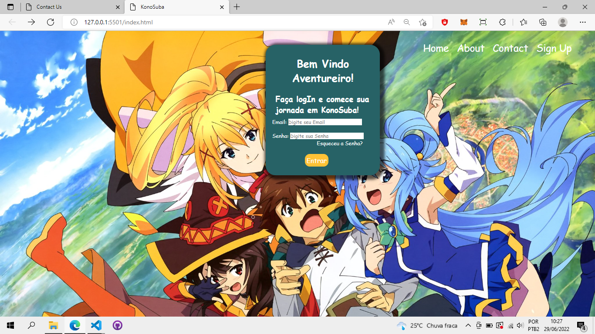
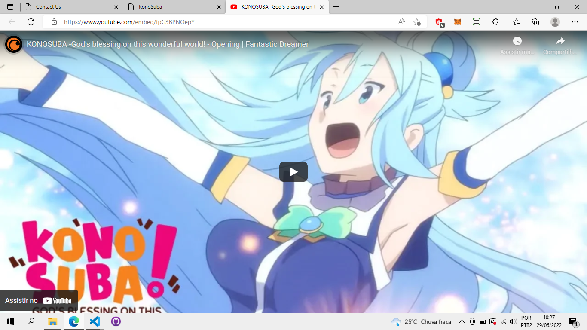
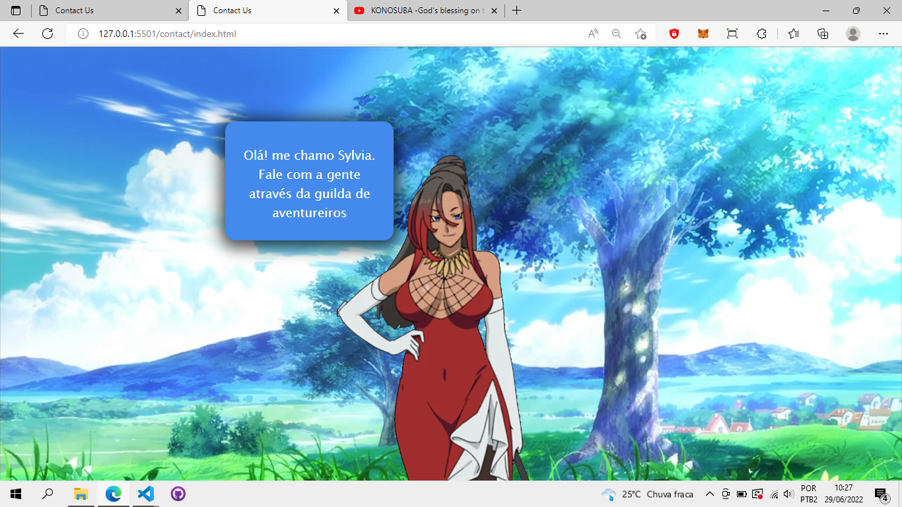
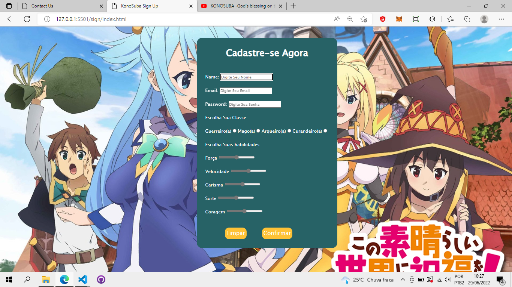
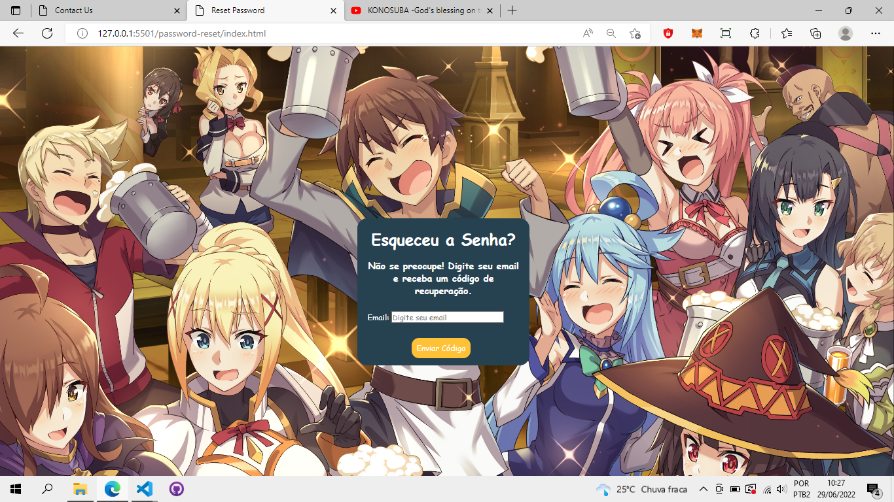
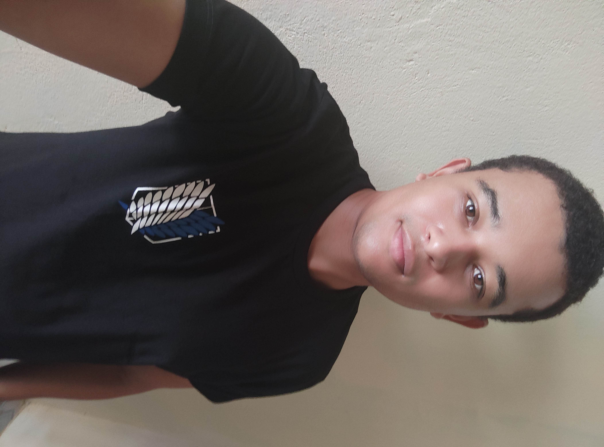

#Project KonoSuba

> Resultado do projeto KonoSuba.

### Sobre:

O projeto é um site simples com tela de login, pagina de contato, cadastro, recuperação de senha, pagina com um pequeno video. exlusivo para computador

- [x] HTML
- [X] CSS

## 🤝 Colaboradores

Agradecemos às seguintes pessoas que contribuíram para este projeto:

<table>
  <tr>
    <td align="center">
      <a href="#">
         
        
          <b>Vagner Santos</b>
        
      </a>
    </td>
  </tr>
</table>

